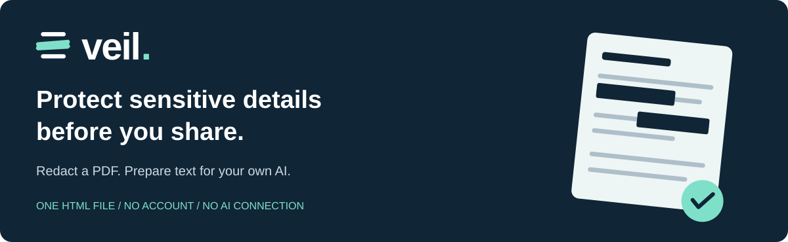
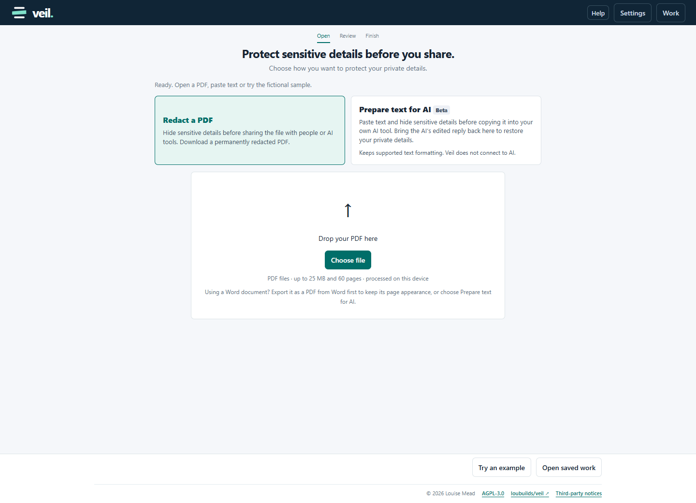

Redact PDFs before sharing them with people or AI tools. Or protect pasted text before taking it to your own AI, then return its edited reply to restore your private details.

**Free and open source. Runs on your device. No account or AI connection.**

[](https://github.com/loubuilds/veil/releases/latest/download/Veil.html)

Download the file, then open it in **desktop Chrome or Edge**. That's it. No installation, server or internet connection is needed to use Veil. Safari and mobile browsers are currently unsupported.

[AGPL-3.0 licence](LICENSE) · [How it works](#two-ways-to-use-veil) · [Privacy and limitations](#privacy-and-limitations) · [Build from source](#build-and-test)



## Two ways to use Veil

### Redact a PDF

Open a PDF, review the suggested highlights and protect anything Veil missed. Preview every exported page, then download a permanently redacted PDF to share with people or AI tools.

Veil renders each page, replaces protected areas with opaque pixels and creates a fresh image-based PDF. Original text objects, attachments, link destinations and source metadata are not copied into that file. Search, text selection and accessibility features may not work in your PDF reader. Some readers can recognise the remaining visible text from images.

Existing translucent highlights may still leave words readable. Cover anything uncertain using Veil's own protection. Check every page for private details; Veil may not highlight everything.

**PDF-to-AI editing and Copy protected text from PDFs are unavailable in this release.** PDFs can contain hidden or previously covered words that text extraction exposes. Ordinary PDF redaction remains available.

### Prepare text for AI (Beta)

Paste text and hide sensitive details before copying it into your own AI tool. Bring the AI's edited reply back to Veil to restore your private details.

1. Paste and review your text. Adjust highlights with Add/Remove, Undo/Redo or Find a name or phrase.
2. Describe the edit you want and copy the protected prompt to your AI tool.
3. Review its draft. Reply **A** to approve or **R** to revise; lowercase works too.
4. Paste its entire final reply back into Veil. It looks like code; Veil reads and checks it for you.
5. Review the restored result, then download Word/PDF or copy formatted/plain text.

Veil keeps supported text formatting, including headings, bold, italics and font settings supplied by the clipboard. Rewritten passages may lose some inline formatting, and destination apps can substitute fonts. Images, complex tables and exact page layouts are not retained. AI editing may simplify formatting so revised text fits properly. Veil does not connect to AI; whatever you copy into another service is subject to that service's practices.

## Supported inputs and limits

- New file uploads: **PDF only**, up to 25 MB and 60 pages. For Word documents, save as PDF in Word first, or paste the wording.
- Pasted plain/formatted text: up to 250,000 characters and 2,500 paragraphs, subject to the bundled fonts. Emoji and many non-Latin scripts are not supported on this route.
- PDF text analysis: up to 250,000 characters and 2,500 blocks. Large image-heavy files may exceed device memory.
- Detection uses deterministic rules, primarily English/UK patterns. Sensitivity settings adjust how cautious suggestions are. Names, contact details, profile links and identifying context still need human review.
- No automatic text recognition in scans or images. You can manually cover visible details in PDFs. Encrypted/XFA PDFs are unsupported.
- Word, email and spreadsheet uploads are not available. Word remains an output option for pasted-text AI edits.

## Save your progress

Use **Work → Save and continue later** to download a `.veil` snapshot. Keep the tool open or save your work if you want to restore private details after AI editing.

**Saved work contains the original private information. Do not share it or upload it to AI.** Password protection is optional; an unencrypted file is readable by anyone who has it. Losing the file/password can prevent recovery. Open only saved work you trust.

Older compatible PDF sessions reopen for redaction, not PDF text sharing. Saved text models can continue after review. Session contents are held in tab memory, not browser storage; closing or refreshing can lose unsaved work. Clearing a session is not a forensic wipe of the device or its downloads.

## Privacy and limitations

Veil does not send documents to a server or model. Its content security policy blocks runtime connections; footer links open external websites only when clicked. Device malware, extensions, clipboard synchronisation and shared download folders remain outside Veil's control.

Placeholders are labels, not encoded private values. Detection cannot guarantee anonymity: remaining narrative context may identify someone. Review protected content and final output before sharing. AI reply checks do not establish that an edit is factually correct.

Outputs are not accessibility-tagged PDFs. Mac Chrome/Edge, native Word rendering and assistive-technology behaviour still need broader real-device testing. Beta status is not a privacy guarantee.

## Build and test

**These instructions are for developers.** To use Veil, just [download Veil.html](https://github.com/loubuilds/veil/releases/latest/download/Veil.html) and open it in desktop Chrome or Edge. You do not need to install dependencies or run these commands.

To build or test Veil from source, you need Node.js 22.13 or newer:

```sh
npm ci --ignore-scripts --no-audit --no-fund
npm run build
npm test
npm run test:hardening
```

Dependency installation needs internet. The app does not. The browser suite needs an already installed Playwright Chromium or a compatible Chrome/Edge executable set with `VEIL_BROWSER_PATH`; it does not install browsers or start a server. It runs the built HTML offline through `file://` and writes synthetic results to ignored `evidence/`.

`dist/build.json` records the distributable's SHA-256 and dependency versions. The tests cover detection, reply validation, layout and saved-work compatibility, browser workflows, actual PDF redaction coverage and blocked PDF text sharing. They are bounded regression checks, not security certification.

See [contributing](CONTRIBUTING.md) for the repository layout and publication rules.

## Licence

Copyright © 2026 **Louise Mead**. Original Veil code is licensed under [GNU AGPL v3 only](LICENSE), without warranty. See [third-party notices](THIRD_PARTY_NOTICES.md) for bundled components. Provide corresponding source as required when sharing a build.
